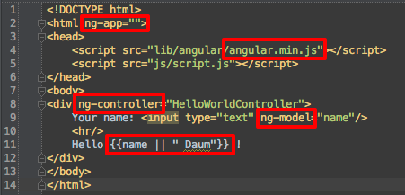

# Angularjs Cookbook

[원문](http://docs.angularjs.org/cookbook)

# Angularjs

angularjs를 한마디로 설명한다면 3D

- Directive
- Dependency Injection
- Data Binding(양방향)

[angular-seed](https://github.com/angular/angular-seed)를 clone하여 시작할 수 있다.

intelliJ 플러그인 [AngularJS](https://github.com/johnlindquist/angularjs-plugin)를 설치하면 문장 완성 기능을 사용할 수 있음.

# Hello World

`hello-world.html`

- ng-app, ng-controller, ng-model directive
- birectional data binding: `{{ xxx }}`

`script.js`

- `$scope`: 메모리 저장소. view와 controller 사이의 데이터 교환에 사용

`hello-world-scenario.js`

- [jasmine](http://pivotal.github.com/jasmine/)과 [Karma](http://karma-runner.github.io/) 사용

	`./scripts/web-server.js`를 실행하면 node.js로 작성된 웹서버가 실행됨.

	`./scripts/test.sh`를 실행하면 unit test가 수행됨. 소스의 변경이 있으면 자동으로 모든 unit test가 재실행

	`./scripts/e2e-test.sh`를 실행하면 [end to end test](http://docs.angularjs.org/guide/dev_guide.e2e-testing)가 실행된다. 이 테스트도 소스가 변경될 때마다 자동으로 재실행된다.
- [원문](http://docs.angularjs.org/guide/dev_guide.e2e-testing). 그런데 e2e test는 [Protractor](https://- github.com/angular/protractor)로 변경될 것이라 함. 원문 페이지에서 모든 api에 대한 설명을 얻을 수 있다.
- `browser().navigateTo(url)`: url을 테스트 프레임으로 로딩한다.
- `expect(future).{matcher}`: 주어진 future가 matcher를 만족시키는지 검증한다. 모든 API 문장은 future 객체를 반환한다. Future 객체는 실행된 후에 할당되는 값을 갖는다. `Matcher`는 `angular.scenario.matcher`를 이용해서 정의된다. matcher는 expectation을 run하기 위해 future의 값을 이용한다.
- `binding(name)`: 주어진 이름에 매칭되는 첫번째 바인딩 값을 반환한다.
- `toEqual`: value and Object comparison
- `input(name).enter(value)`: name을 갖는 ng-model의 텍스트 필드에 값을 입력한다.

이 예제는 input 필드에 텍스트를 입력하면 양방향 바인딩(`{{ xx }}`)을 이용해서 화면서 입력된 값을 바로 보여준다.

`web-server.js`를 를 실행한 후 [http://localhost:8000/app/hello-world.html](http://localhost:8000/app/hello-world.html)를 통해 확인해 볼 수 있다. e2e 테스트 결과는 [http://localhost:8000/test/e2e/runner.html](http://localhost:8000/test/e2e/runner.html)에서 확인해 볼 수 있다.

# Basic Form
`basic-form.html`

- ng-click, ng-repeat, ng-pattern
- `{{user | json}}`: json 형식으로 출력. 이쁘게

`basic-form.js`

- state, zip 필드에 대해서 validation rule을 정규식으로 표현
- addContact, removeContact 메소드 구현

`basic-form-scenario.js`

- `using(selector, label)`: Scopes the next DSL element selection.
- `element(selector, label).click()`: Clicks on the element matching the given jQuery selector. The label is used for test output.

예제를 [실행](http://localhost:8000/app/basic-form.html)하고 필드에 값을 변경하면 양방향 데이터 바인딩에 의해 JSON 형식으로 표현되는 user 객체의 값이 즉각적으로 변경되는 것을 확인할 수 있다.

# Advanced Form

`advanced-form.html`

- ng-disabled

`advanced-form.js`

- `cancel`, `save`는 변경 내역이 있을때만 활성화됨
- $invalid를 이용해서 valid한 경우와 변경 사항이 있는 경우만 `save` 버튼을 활성화
- `cancel` 버튼은 폼의 내용을 초기값으로 전환
- 디버그 뷰

`advanced-form-scenario.js`

# MVC

`mvc.html`

- ng-style

`mvc.js`

`mvc-scenario.js`

- controller는 JavaScript로 정의되고, rendering logic에 대한 reference를 갖는다.
- controller는 Angular에 의해 인스턴스화되고 view에 주입된다.
- controller는 view와 무관하게 인스턴스화 될 수 있다. 이로 인해 테스트가 가능해 진다.
- controller의 모든 property는 view에서 사용될 수 있다.
- model을 변경하면 view가 변경된다.
- view는 controller의 함수들을 호출할 수 있다.

# Multi-page App and Deep Linking

`deep-linking/index.html`

- url은 반드시 `#/`으로 시작해야 함.
- ng-view

`deep-linking/deep-linking.js`

- ngRoute, $routeProvider, $inject

`deep-linking/welcome.html`

`deep-linking/settings.html`

`deep-linking-scenario.js`

- Routes는 AppCntl 클래스에 정의된다. controller의 초기화는 적합한 URL route를 갖는 $route 서비스의 초기화를 일으킨다.
- $route 서비스는 URL을 주시하고 URL이 변경되면 정의된 controller를 인스턴스화한다.
- ngView 위젯은 URL이 변경되면 view를 로드한다. 또 view scope을 새롭게 인스턴스화된 controller에 설정한다.
- URL 변경은 controller와 view를 변경하기에 충분하다. 사용자에 의해서 URL이 변경되든지 프로그램에 의해서 변경되든지 차이가 없다.

# 결론

- front를 꺼리던 사람이 흥미를 갖게한다.
- e2e test는 web app의 integration(scenario) 테스트로도 활용 가능할 듯
- 구글이 준비 중인 polymer([https://github.com/Polymer/polymer](https://github.com/Polymer/polymer), [http://www.polymer-project.org/](http://www.polymer-project.org/), [http://www.html5rocks.com/ko/tutorials/webcomponents/yeoman/](http://www.html5rocks.com/ko/tutorials/webcomponents/yeoman/))도 관심을 가져야 할 듯
- e2e test api는 [원문](http://docs.angularjs.org/guide/dev_guide.e2e-testing)을 참고.